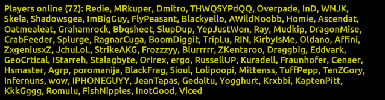
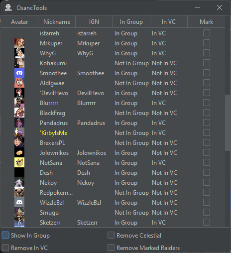

	<blockquote>
OsancTools is a Java application containing various tools for making security work in the Oryx Sanctuary discord server much easier.
</blockquote>
	This webpage goes over the various aspects of the OsancTools program in detail. As the program is still in development, parts of the page may be changed/removed and new features may not be included. 
	  
	A video that walks through some of the various features of this program, including the process of obtaining your WebApp token, is embedded below if you prefer:
	  
	

		<iframe width="500" height="350"
		src="https://www.youtube.com/embed/UPoG2YJ-jgM">
		</iframe>
		 
		<i>Walkthrough of the program made by Qmo.</i>
	

	  
	<b>03/06/2024:</b> The content on this page is outdated and had originated from <a href="https://waifu.github.io/osanctools.html">https://waifu.github.io/osanctools.html</a>.

	<h2>Downloading OsancTools</h2>
	You can download the program by going to the <a href="https://github.com/die/OsancTools/releases">releases page</a> of the Github repository.
	  
	To use the sniffer functionality, you must install:
	  
	<li style="margin-left: 20px"><a href="https://npcap.com/">Npcap</a></li>					
	 
	In addition, this program relies on two <b>optional</b> programs:
	  
	<li style="margin-left: 20px"><a href="https://download.oracle.com/java/19/latest/jdk-19_windows-x64_bin.exe">JDK</a></li>
	<li style="margin-left: 20px"><a href="https://www.torproject.org/download/">Tor Browser</a></li>
	 
	If you get the prompt <b>This application requires a Java Runtime Environment</b> when running the executable, and you don't want to download ~130 mb for the Bundled Version, get this. To make requests through Realmeye with Tor, run Tor Browser and just have it connected. If the button to connect doesn't show up, keep opening Tor until it does. While Tor is open and connected, you don't need to do anything more.
	  
	<h2>Configuration</h2> 
	If using the WebApp integration, you need to provide your secret WebApp token. To do this, head over to the <a href="https://osanc.net/">WebApp</a> and open the developer console. On Google Chrome, this can be done by right clicking the page, selecting <b>Inspect Element</b> and then go to the <b>Console</b> tab. Next, type in <b>localStorage.getItem('at')</b> and hit the enter key. This is your token, <b>do not share this to anybody</b>.
	  
	To input the token, go to the <b>Options</b> tab in OsancTools and paste the token in the text field below <b>WebApp Token</b> and click the <b>Set Token</b> button.
	  
	If you intend on using the packet sniffer functionality, you also need to select the <b>Set Resource Dir</b> button and select the <b>resources.assets</b> file which is typically found in the <b>Documents\RealmOfTheMadGod\Production\RotMG Exalt_Data</b> directory. The purpose of this is to gather item ids for reading equipment data so that when new items are added to the game the sniffer can automatically interpet them and get their names rather than pushing an update everytime an item is added to the game.
	  
	Furthermore, other configuration options include changing the theme, showing a Realmeye alert, and clearing your settings. The first allows you to switch between light and dark modes. The second controls whether a prompt will appear on launch if it is found that the Realmeye servers cannot connect to the RotMG servers, which provides the parser information to know if Realmeye will be accurate or not. The third lets you clear all settings stored by the program in case you stop using it. For reference, the options tab will look something like this:
	  
	
 <i>Example options panel.</i>

	 
	Finally, there is a <b>Sheets</b> tab that allows you to switch between requirement sheets. Currently, custom requirement sheets are not supported and you can only use the requirement sheets built into the program. If the requirement sheet uses a point system, there is a <b>Modify Class Points</b> button that allows you to change the points for individual classes. This tab looks something like this:
	  
	
 <i>Example sheets panel.</i>

<h2>How to Parse</h2>

	When it comes to parsing, there are two sources to getting data. One uses Realmeye, and another uses a packet sniffer. 
	  
	The method using Realmeye takes time in order to avoid abusing the site through quick and successive requests. Due to the ambiguity of Realmeye's stance on scraping, it is recommended to use the Tor Browser to avoid any chances of an IP ban. While efforts have been made to limit how many requests are made to Realmeye, I <b>cannot guarantee</b> that an IP ban won't happen. The program will display a prompt before making any Realmeye requests in the case that Tor is not being used. Furthermore, as some raiders have private profiles, Realmeye will fail to provide data for them. However, Realmeye guarantees that every raider can be checked.
	  
	Furthermore, the method using the packet sniffer cannot guarantee that every raider is parsed as they must load into your location while you are present. However, the packet sniffer provides the most accurate information as Realmeye information can be wrong if the raider IP connects or a Realmeye bot is not in the nexus. In addition, the packet sniffer has the ability to parse the max stats of a raider <b>even if their visibility is off</b>. This seems to be an intentional decision by DECA and is a byproduct of the same method for collecting publically visible data in game.

<h3>Disclaimer</h3>

	This program is hardcoded to an extent because most aspects of parsing are not standardized.
	This is where your parsing knowledge comes in! 
	This program helps you, but it is not an end-all-be-all for parsing. 
	<b>Do not</b> rely on it to be accurate every time. My aim is for this to be the case,
	but as the game and requirements change frequently, it is difficult to always stay up-to-date.
	  
	If a reskin must be added, or changes have been made to a specific requirement sheet,
	the current requirement sheets can be found <a href="https://github.com/die/OsancTools/tree/master/src/main/resources/sheets">in the requirement sheet directory.</a> 
	You can make an issue, pull request, or contact me to get it fixed. 

<h2>Parse Sets</h2>

	To parse sets, click on the <b>Parse Sets</b> button and select which method to use. It is recommended to do this after the reacts if you are parsing with the WebApp. If you are parsing with Realmeye, wait for the progress bar to fill up and the table will display when the process is finished. If you are using the packet sniffer, you want to start the sniffer by selecting the option before everyone loads into the realm or dungeon. Once everyone has loaded in, you can click on the <b>Stop Sniffer</b> button and the table will display. This table will look like this:
	
 <i>Example set parse table.</i>

	 
	

		There are four columns in the table. The first column indicates what type of problem there was with the raider. Example problems are where a swapout/banned item/empty slot was found, an under reqs item was found, the raider wasn't maxed in the required stats, the raider had a private profile, or the raider didn't meet the required points. If the raider meets requirements, the problem will be "None". The second column contains the username of the raider. Some usernames may be color coded in order to group alternate accounts of a specific raider. The third column displays the inventory of that raider. An item will be yellow if it is a swapout, where you should reach out and see if they have an item that meets requirements. An item will be marked red if it goes against the requirement sheet, examples are banned item, under reqs, etc. If a point requirement sheet is used, items that provide points will be marked cyan. In addition, you can <b>ctrl+C</b> a cell in the inventory column to copy the item names as well as a message. Sometimes an image for an item isn't present in the program and so copying the inventory will tell you what item it was. This message can include the maxed stats that were missing, for example. The last column stores checkboxes where you can mark rows that have been handled already.
		  
		In addition, there are four checkboxes and a <b>Parse Guild Leaks</b> button. The first checkbox removes sets that meet requirements, while the second checkbox removes sets that don't meet requirements. The third checkbox removes rows that have private profiles on Realmeye, or where the items for a raider were not updated in the case of using the sniffer to parse. The final checkbox removes rows with a marked checkbox to remove clutter. The button at the bottom will be disabled if no crashers were obtained. In the case of the sniffer, if there are crashers, which are players not in the WebApp, you can click the button and a panel will appear that displays any leaks between guild members. A leak in that case is where a guild member in the WebApp provides the location, either through the guild tab or communication, to another guild member not in the WebApp. The resulting panel will show the guild name as well as the leaker's username on the left and the crasher on the right. An example of this is shown below:
		
 <i>Example guild parse panel.</i>

		 
		When it comes to requirement sheets, currently the veteran sheet for Oryx Sanctuary doesn't take into account exalted skins. Therefore, do account for this when parsing if somebody seems to be one point off by locking them in game.
	

<h2>Parse Reacts</h2>

	To parse reacts, you need to be connected to a WebApp raid. When parsing, it is recommended to press the <b>Parse Reacts</b> button once everyone has loaded into the realm. Once pressed, you must wait for the progress bar at the bottom to fill up. Once the process is finished, a table will display that looks like this:
	
 <i>Example react parse panel.</i>

	 
	

		There are five columns in the table. The first column displays the image of the react that's on the WebApp. The second column displays the username of the raider who had reacted. The third column displays the raider's detected class and inventory. This will be a Wizard with empty slots if the raider's Realmeye was found to be private, or with no characters logged in. Items or classes that are marked green indicate that they satisfy the react. If any of them are marked red, that means the react was not satisfied by that class/item. For dps reacts, an exalted skin counts as a point. Therefore, if there isn't a whisper message and a point seems to be missing, this is why. The fourth column provided messages that can be copied using <b>ctrl+C</b>. Manual reacts, such as runes and inc, or new reacts that currently cannot be parsed will display a lock command. Other reacts will display a custom generated whisper command that can be copied and sent to the raider in game. The message will be "None" if there are no problems with the raider. The last column contains checkboxes that can be clicked to mark a raider.
		  
		Furthermore, there are four checkboxes that help filter the results in the table. The first checkbox removes raiders who you don't need to deal with as they satisfy their react. The second checkbox only shows raiders who do satisfy their react. The third checkbox removes all raiders with a lock message. <b>It is important</b> that you make sure that no new reacts are removed by doing this, as you need to manually confirm these reacts when parsing. Finally, the last checkbox allows you to remove raiders who have been marked by their checkbox in order to remove clutter.
	

<h2>Parse VC</h2>

	In order to parse the voice channel, you currently have to provide a /who screenshot as well as be connected to a WebApp raid.
	An example of a /who screenshot is shown below:
	 
	
 <i>Example /who screenshot.</i>

	 
	

		The recommended time to get this screenshot is when everyone loads into the Wine Cellar. Once the screenshot is taken, click on the <b>Parse VC</b> button. A panel should appear that looks like this:
		
 <i>Example input panel for the /who screenshot.</i>

		 
		

			You can either select the image in a directory by using the <b>Open From File</b> button, paste the image using <b>ctrl+V</b>, or drag the file itself into the panel. When the image is inputted, it will display in the rectangular panel. Once you select the <b>Choose</b> button, a table will appear that looks similar to this:
			
 <i>Example vc parse table.</i>

			 
			

				There are six columns in the table. The first column shows the avatar of the raider in the WebApp. Currently, GIF avatars do not show properly due to the behavior of smooth image scaling. In addition, you can select the cell that contains their avatar and <b>ctrl+C</b> to copy the discord id into your clipboard. The second column shows the <b>server nickname</b> of the raider. The server nickname is yellow if the raider has the celestial role. The third column stores the IGN of a player found in the /who screenshot. Therefore, if the IGN cell is blank, this means that the raider was not found in the /who. The fourth column indicates if a raider is in the group, or in other words in the /who screenshot. The fifth column indiciates the raider is in the current raiding voice channel, meaning that you should <b>always</b> run a find command to make sure the raider isn't in another voice channel. Finally, the sixth column stores checkboxes so that you can mark a raider once you've dealt with them.
				  
				Furthermore, there are four checkboxes at the bottom to filter out rows. The first checkbox removes raiders that are not in group, which is helpful so you know what raiders are still in the run. The second checkbox removes raiders who are in the raiding voice channel as they don't need to be parsed. The third checkbox removes all raiders who have the celestial role, which is helpful as those with celestial don't have to be in the raiding voice channel. Finally, the fourth checkbox removes all rows that have a marked checkbox, which helps to remove clutter. 
			

		

	

<h2>Exalt Calculator</h2>

	OsancTools comes with an <b>Exalts</b> tab that calculates dungeon completions based on a player's Realmeye exaltations, which looks like this:
	
 <i>Example exaltation calculator panel.</i>

	 
	<h2>Configuring the Calculator</h2>
	The following stats can be selected through a radio button:
	  
	<li style="margin-left: 20px">Life - Oryx Sanctuary</li>
	<li style="margin-left: 20px">Mana - The Void</li>
	<li style="margin-left: 20px">Attack - The Shatters</li>
	<li style="margin-left: 20px">Defense - Lost Halls</li>
	<li style="margin-left: 20px">Speed - Cultist Hideout</li>
	<li style="margin-left: 20px">Dexterity - The Nest</li>
	<li style="margin-left: 20px">Vitality - Kogbold Steamworks</li>
	<li style="margin-left: 20px">Wisdom - Fungal Cavern</li>
	 
	To set the number of dungeon completes required, type a number in the text field below the text <b>Set requirement</b>, and then click on the <b>Set</b> button to confirm the change.
	  
	To use the calculator, paste an IGN in the text field below the text <b>Enter username</b> and then click enter.
	  
	Below the <b>Result:</b> text, text will be displayed that shows the number of completes, the boss for your selection, and the requirement used. 
	This is so you know for sure that the calculation is done properly with the right requirement and dungeon. 
	  
	If the text is green, the raider meets the requirement for the number of completions.
	If the text is red, this means that the raider doesn't have enough completions <b>through Realmeye exaltations</b> for that dungeon.
	If the text is yellow, this means that there was some sort of error, which could be that the Realmeye profile was private.
	  
	An example result is shown below:
	  
	
 <i>Example result with the calculator.</i>

